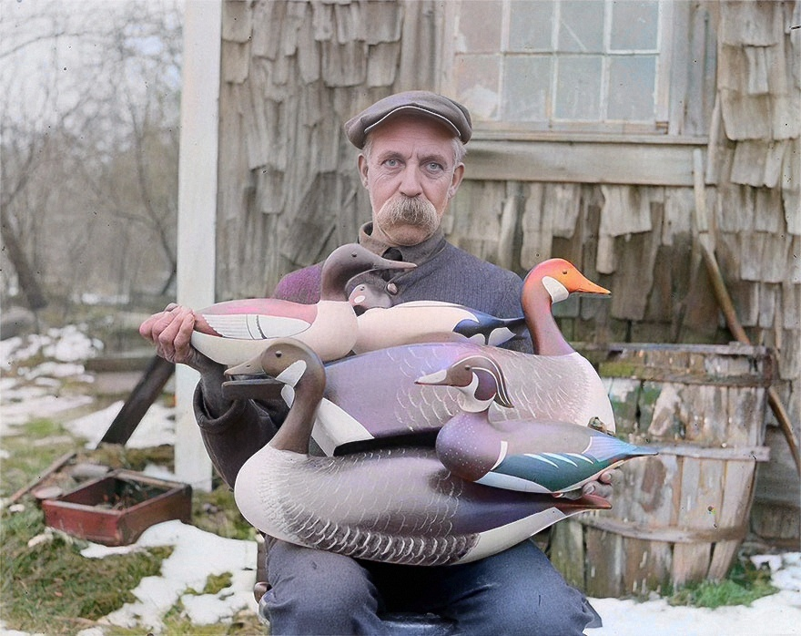

# 🖼️ Old Photo Restorer  
### Automatic Colorization + Face Restoration + Final Cleanup

[]()
[]()
[]()

Old Photo Restorer is a fully automated pipeline for restoring old photographs.  
It combines several state-of-the-art AI models:

- 🎨 **DDColor** — deep colorization  
- 👤 **GFPGAN** — face enhancement & restoration  
- ✨ **Custom post-processing** — smoothing, noise removal, tone correction  

The pipeline takes black-and-white or faded photos and produces natural-looking, restored output.

---

## 📌 Features

✔ Automatically colorizes grayscale or faded photos  
✔ Enhances faces while keeping identity  
✔ Removes artifacts & excessive noise  
✔ Adjusts tones and improves overall color balance  
✔ Works on batches (multiple photos at once)  
✔ Plug-and-play — no ML knowledge needed  
✔ Fully open source  

---

## 🧩 Pipeline Architecture

```
Input Photo(s)
      ↓
[1] DDColor (HuggingFace model)
      ↓
[2] GFPGAN (face restoration)
      ↓
[3] Post-processing:
        • Denoising
        • Bilateral skin smoothing
        • Tone & color adjustments
      ↓
Final Output
```

---

## 📸 Before / After Example

Below is an example restored by the pipeline.  
Replace the links with your actual images stored in `/docs/`.

| **Before** | **After** |
|-----------|-----------|
|  |  |

---

## 📁 Project Structure

```
old-photo-restorer/
│
├── input/                     # Your original photos
├── output_ddcolor/           # Results from DDColor
├── output_faces_restored/    # Results from GFPGAN
├── output_final/             # Final processed images
│
├── ddcolor/                  # DDColor source
├── gfpgan/                   # GFPGAN source
│
├── pipeline.py               # Main processing script
├── postprocess.py            # Tone & smoothing adjustments
├── requirements.txt
├── README.md
└── .gitignore
```

---

## 🚀 Installation

### 1. Clone the repository

```bash
git clone https://github.com/yourusername/old-photo-restorer.git
cd old-photo-restorer
```

### 2. Create a virtual environment (recommended)

```bash
python -m venv venv
```

Windows:

```bash
venv\Scripts\activate
```

### 3. Install dependencies

```bash
pip install -r requirements.txt
```

### 4. Download GFPGAN model weights

Create folder:

```
gfpgan/weights/
```

Download:

```
GFPGANv1.4.pth
```

(You can find it on GFPGAN official repo.)

---

## ▶️ Running the Pipeline

Place your black-and-white photos into:

```
input/
```

Then run:

```bash
python pipeline.py
```

All outputs will appear in:

- `output_ddcolor/`
- `output_faces_restored/`
- `output_final/` (this is the final result)

---

## 🎨 Post-Processing (Optional)

If you want to adjust color/tone/softness:

```bash
python postprocess.py --input output_faces_restored --output output_final
```

Settings can be changed inside `postprocess.py`.

---

## ✨ Example Results (More Samples)

Replace with your own:

### Example 1
**Before**  


**After**  


---

## 🛠️ Technologies Used

| Module | Purpose |
|--------|---------|
| **DDColor** | Colorization |
| **GFPGAN** | Face restoration |
| **OpenCV** | Denoising & smoothing |
| **NumPy** | Image ops |
| **Python 3.11** | Core runtime |

---

## 🤝 Credits

This project integrates the amazing work of:

- **DDColor** – https://github.com/KwaiVGI/DDColor  
- **GFPGAN** – https://github.com/TencentARC/GFPGAN  
- **Real-ESRGAN / BasicSR** – https://github.com/xinntao/BasicSR

Huge credit to the original authors.

---

## 📄 License

This project is distributed under the **MIT License**.  
You may use, modify, and distribute it freely.

---

## ⭐ Support

If you like this project, consider giving it a **star** on GitHub ❤️  
Pull requests and contributions are welcome!

